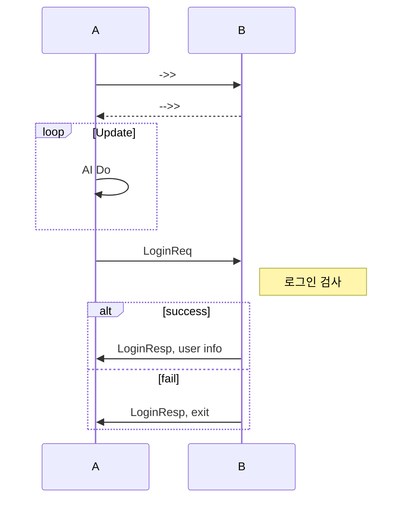
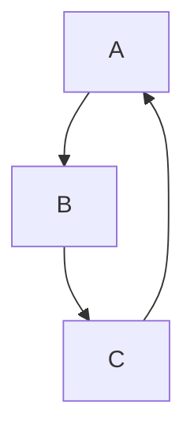

# mermaid [](https://travis-ci.org/mermaid-js/mermaid) [](https://www.npmjs.com/package/mermaid) [](https://coveralls.io/github/mermaid-js/mermaid?branch=master) [](https://join.slack.com/t/mermaid-talk/shared_invite/enQtNzc4NDIyNzk4OTAyLWVhYjQxOTI2OTg4YmE1ZmJkY2Y4MTU3ODliYmIwOTY3NDJlYjA0YjIyZTdkMDMyZTUwOGI0NjEzYmEwODcwOTE) [](https://percy.io/Mermaid/mermaid)

## git 사용
### 대용량 파일 업로드 방법
1. 대용량 파일을 업로드 하기 위해서는 lfs(Large File Storage)가 설치되어 있어야한다.
2. git prompt에서 git lfs install
3. git lfs track "파일 이름" | "*.확장자명"
4. 3번을 실행하면 .gitattributes에 lfs가 등록된다.
   - ex) *.zip filter=lfs diff=lfs merge=lfs -text

## Mermaid 사용
\``` mermaid  
\```  
위 코드블럭으로 mermaid 코드블럭을 생성

## Sequence diagram
코드블럭 안에 `sequenceDiagram` 키워드로 사용  
- ->> 실선
- -->> 점선
- : 메시지
- loop end : loop 블럭 생성
- alt else end opt : if else 블럭 생성
- Note right of ??? 메모 생성



## Flowchart
코드블럭 안에 `graph TD;` 키워드로 사용
- a --> b a에서 B로 진행


<!-- ## Class diagram
코드블럭 안에 `classDiagram` 키워드로 사용

``` mermaid
classDiagram
TcpServer : int a
TcpServer --* SessionServer
``` -->